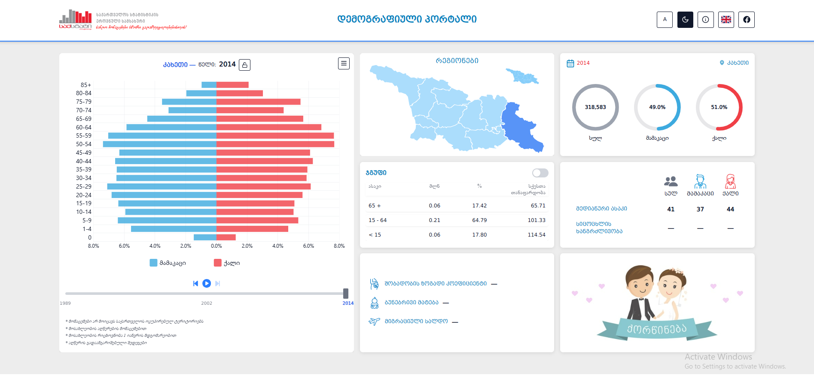

## ⚡ Project: Demographic Statistics Portal

**Demographic Statistics Portal – Georgia Edition** is a web-based platform that aggregates and visualizes **Georgia's key demographic indicators**. Explore trends in **population structure, age-sex distribution, life expectancy, marriages**, and more — through interactive dashboards and intuitive charts.

Built for **policymakers, researchers, and the public**, it delivers **data-driven insights** into Georgia's demographic performance in a clean, accessible format.

---

## ✨ Features

- 📊 **Population Pyramid** – animated age-sex structure from 1926 to present with lock & compare functionality
- 🗺️ **Interactive regional map** – explore demographic data by Georgian regions via GeoJSON
- 🧮 **Life Expectancy Calculator** – find your life expectancy by age, gender, and year
- 💍 **Marriage statistics** – interactive distribution chart by age and gender
- 📈 **Demographic indicators**: population count, sex ratio, median age, birth rate, natural increase, net migration
- 🎚️ **Custom age groups** – select and compare up to three age ranges on the pyramid
- 🌐 **Bilingual interface**: Georgian (`/ka`) | English (`/en`)
- 🌙 **Dark/Light mode** – toggle between themes
- ♿ **Accessibility** – text size toggle for improved readability
- 📱 **Fully responsive** – seamless on mobile, tablet, desktop

---

## 🖼️ Screenshot



---

## 🚀 Live Demo

🔗 **[demographic-statistics-portal.vercel.app](https://demographic-statistics-portal.vercel.app/)**
_(Toggle language in the top-right corner)_

---

## 📊 Data Sources

All data is sourced from **official Georgian institutions**, including:

- [National Statistics Office of Georgia (Geostat)](https://www.geostat.ge/en)
- Population census data (1926–2014)
- Annual demographic estimates (1994–present)

---

## 🛠️ Tech Stack

| Category | Technology |
|---|---|
| **Framework** | [React 19](https://reactjs.org/) |
| **Build Tool** | [Vite](https://vitejs.dev/) |
| **Routing** | [React Router DOM v7](https://reactrouter.com/) |
| **Styling** | [Tailwind CSS v4](https://tailwindcss.com/) |
| **Charts** | [AMCharts5](https://www.amcharts.com/) |
| **Maps** | [Leaflet](https://leafletjs.com/) + GeoJSON |
| **Icons** | [React Icons](https://react-icons.github.io/react-icons/) + [Flag Icons](https://flagicons.lipis.dev/) |
| **Exports** | jsPDF, xlsx |
| **Analytics** | [Vercel Analytics](https://vercel.com/analytics) |
| **Deployment** | [Vercel](https://vercel.com/) |

---

## 🔧 Getting Started Locally

```bash
git clone https://github.com/saba-bar95/demographic-statistics-portal.git
cd demographic-statistics-portal
npm install
npm run dev
```

App runs at **http://localhost:5173**

---

### 👨‍💻 Author

[Saba Barbakadze – GitHub Profile](https://github.com/saba-bar95)
